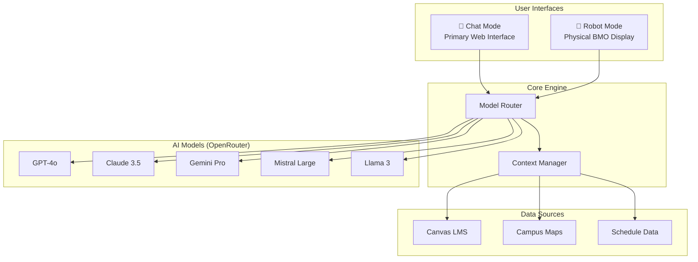

# BMO AI Student Assistant
## Vision & Architecture

---

## 🎯 Vision

**BMO** evolves from a campus tour guide into a **comprehensive AI Student Assistant** for Alamein International University — a single intelligent hub that helps students with academics, navigation, and daily campus life.

> *"Your AI companion for university life — from finding your next class to acing it."*

---

## 🌟 Core Pillars

| Pillar | Description |
|--------|-------------|
| **📚 Academic Support** | Canvas LMS integration, course info, schedules, assignment tracking |
| **🗺️ Campus Navigation** | Interactive maps, directions, building/room search |
| **🤖 Multi-Model Intelligence** | 5+ AI models via OpenRouter for diverse query types |
| **💬 Dual Interface** | Chat Mode (web) + Robot Mode (physical BMO) |

---

## 🏗️ System Architecture

---

## 📱 Dual Interface Design

### Chat Mode (`/`)
The primary web interface for everyday use:
- Full-featured chat with markdown support
- Model selector (choose your AI)
- Quick actions for common queries
- Schedule & map integration
- Voice input option

### Robot Mode (`/robot`)
Dedicated interface for physical BMO robot:
- Full-screen BMO face display
- Voice-first interaction
- Large touch targets
- Simplified navigation cards
- Optimized for Raspberry Pi/tablet

**Sidebar Navigation:**
- Home (Chat Mode)
- **BMO Robot** → links to Robot Mode
- Schedule
- Campus Map
- Settings

---

## 🔗 Integration Points

### Canvas LMS
- OAuth2 authentication
- Course listings & syllabi
- Assignment deadlines
- Grade tracking
- Calendar events

### Campus Maps
- Zone-based system (Yellow/Red/Blue)
- Building search
- Room navigation
- Library anchor for directions

### Multi-Model Router

| Model | OpenRouter ID | Use Case |
|-------|---------------|----------|
| **Qwen 2.5-VL 3B** | `qwen/qwen-2.5-vl-3b-instruct` | Spatial reasoning, camera feed analysis ("The blue door", "The water spill") |
| **Llama 3.2 1B** | `meta-llama/llama-3.2-1b-instruct` | Ultra-fast lookups, ID checks, schedule formatting |
| **Gemini 2.5 Flash** | `google/gemini-2.5-flash` | All-rounder, conversation, massive context for school-wide info |
| **DeepSeek R1** | `deepseek/deepseek-r1-distill-llama-8b` | Complex reasoning, difficult math/logic problems |

---

## 🎨 Design Language

Inherits from current BMO:
- **6 Developer Themes** (Catppuccin, Dracula, Nord, Gruvbox, Solarized, Monokai)
- **Dark/Light modes** for each theme
- **Glassmorphism** effects
- **GSAP + Framer Motion** animations
- **CSS Variables** for theming

---

## 🧭 Development Approach

We will build **incrementally, one feature at a time**:

1. First, establish the new app structure with sidebar navigation
2. Then, add features one by one based on priority
3. Each feature is a complete vertical slice (UI + API + integration)

> *Development order and specifics will be decided as we progress together.*
